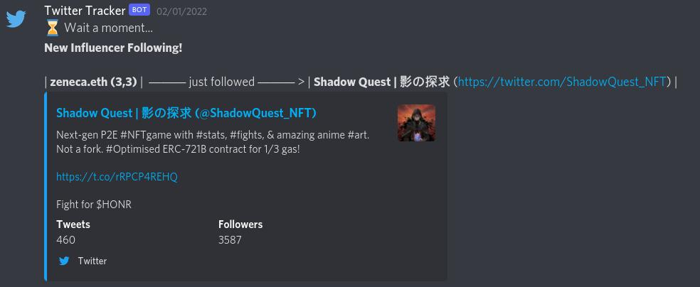

# Twitter Tracker Discord Bot 🕵️

Track following activity of accounts you follow from your burner twitter account, and notify it on discord!

### Demo



### Usage

```
git clone git@github.com:gurbaaz27/twitter-tracker-discord-bot.git
cd twitter-tracker-discord-bot
python -m venv venv
source venv/bin/activate
pip install -r requirements.txt
```

Create a `.env` file in the directory with the content which can be seen from `template.env` file, and then finally run

```
python main.py
```

The bot checks any new follow activity every 15 minutes itself. Also, you can use `t.updatefol` command in your server to get hold of any new activity.

> __*NOTE*__: Given the limitation of twitter API calls to check following and follows one can make in 15-minute window, one gets limited to how much following activities one can observe in a time frame.


### Approach: A Reddit [post](https://www.reddit.com/r/Discord_Bots/comments/sfp5je/discord_bot_to_track_new_follows_in_twitter/)

**Me**: 

I have a moderate experience in building Discord bots, and I am posed with a challenge, and I wanted an opinion on its feasibility from the community. Given some list of people on twitter (the list can go grow later with time), I need to notify in a discord channel when a user from that list follows anyone on twitter, eg. Person xyz just followed Person abc!, etc. One way I was thinking to do this was to set up a burner account and follow people on these list, and then using twitter api get their followers list and store it somewhere. Then after some periodic intervals, say 30 min, I again get api responses and check for any change. But this solution seems poor to me in terms of its rawness and scalability issues.

I wanted to know feasible and scalable methods to accomplish this task, using twitter apis, webhooks, or any other python libraray ,etc. Any help would be appreciated.

**Th3OnlyWayUp**:

From what I've seen, this looks like the most feasible. Scalability is not an issue unless you're dealing with millions of records, an SQLite database and asynchronous programming will keep your code fast and efficient. No need to complicate, your method seems like it would work.

Authenticate > Periodically > Add follower list to database along with unix timestamp > Check records with the timestamp that's closest to the current one > Find differences > Post to webhook
